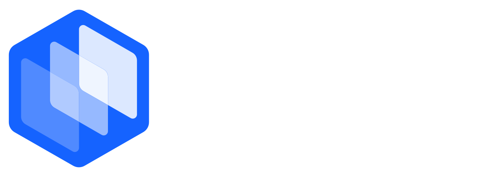

<p align="center">
  <a href="https://controlplane.com">
    
  </a>
</p>

# Control Plane AI Plugin

The AI plugin for [Control Plane](https://controlplane.com) — the platform that runs your containerized workloads across AWS, GCP, Azure, OCI, and your own hardware under one API. Run containers as fully managed workloads with no cluster to operate, grouped into a **GVC (Global Virtual Cloud)** that can span multiple regions and cloud providers at once — or, when you want Kubernetes, let Control Plane provision and manage clusters (mk8s) across a dozen providers, or register the ones you already run. Either way, Control Plane handles autoscaling, multi-region routing, credential-free cloud access (Universal Cloud Identity), private-network connectivity, secrets, RBAC, observability, and compliance.

This plugin loads Control Plane's domain knowledge, production guardrails, and live MCP access into Claude Code, Codex, Gemini CLI — so your assistant deploys and troubleshoots workloads, grants credential-free cloud access without IAM keys, and migrates Kubernetes, Docker Compose, and Helm projects onto Control Plane with verified `cpln` commands.

## Installation

### Claude Code

Add the marketplace, install the plugin, then reload plugins:

```text
/plugin marketplace add controlplane-com/ai-plugin
/plugin install cpln@controlplane
/reload-plugins
```

**Update to a newer release:** third-party Claude Code marketplaces have auto-update **disabled by default**, so you control when updates land. Either run the manual commands below when a new release is published, or enable auto-update once and forget it.

```text
/plugin marketplace update controlplane
/reload-plugins
```

To enable auto-update so future releases install at session start, run `/plugin`, open the **Marketplaces** tab, select **Control Plane**, and choose **Enable auto-update**. Claude Code will then refresh the marketplace and updated plugins on startup.

### Codex

Add the plugin marketplace to Codex:

```bash
codex plugin marketplace add controlplane-com/ai-plugin
```

Then start Codex and open `/plugins`. Use the left/right arrow keys to navigate between marketplaces until you reach Control Plane, then select and install the `cpln` plugin. The Codex plugin manifest points to `.codex-plugin/mcp.json`, which installs the hosted `cpln` MCP server. On first MCP call, you'll be prompted to sign in to Control Plane and choose which organizations the assistant may operate on.

If you prefer the standalone marketplace installer, install the plugin artifact directly from GitHub:

```bash
npx codex-marketplace add controlplane-com/ai-plugin/plugins/cpln --plugin
```

**Enable plugin hooks for guardrail injection (recommended).** Codex ships with the `plugin_hooks` feature off by default, which gates both display and execution of plugin-bundled hooks. The Control Plane plugin uses a `SessionStart` hook to inject the `cli-conventions` and `cpln-guardrails` rules into every Codex session so the assistant respects the production write-guardrails (typed confirmations on destructive ops, org/GVC sanity checks, no invented `cpln` flags). To enable, add this block to `~/.codex/config.toml` and restart Codex:

```toml
[features]
plugins = true
plugin_hooks = true
```

After the restart, `/plugins` → **Control Plane** → **Hooks** should show `SessionStart`. Without this, Codex still loads skills and MCP tools, but the guardrails are not injected automatically and the Hooks row reads "No plugin hooks."

**Update to a newer release:** Codex does not auto-update plugin marketplaces. Run the upgrade command when a new release is published, then restart Codex so the new plugin manifest is picked up.

```bash
codex plugin marketplace upgrade controlplane
```

### Gemini CLI

Install the extension from GitHub with auto-update:

```bash
gemini extensions install https://github.com/controlplane-com/ai-plugin.git --auto-update
```

**Update to a newer release:** if the extension was installed without `--auto-update`, pull the latest version manually. Use `--all` to update every installed Gemini extension in one shot.

```bash
gemini extensions update cpln
# or
gemini extensions update --all
```

### Fresh Clone

Use a manual clone when you want to inspect or modify the plugin locally before installing it into a client:

```bash
git clone https://github.com/controlplane-com/ai-plugin.git
cd ai-plugin
```

### Generic MCP Client

If your client only needs MCP and does not consume one of this repo's plugin formats, add the `cpln` server manually:

```json
{
  "mcpServers": {
    "cpln": {
      "type": "http",
      "url": "https://mcp.cpln.io/mcp"
    }
  }
}
```

## Authentication

MCP authentication uses OAuth 2.1 + PKCE. On first use, the client prompts you to sign in to Control Plane and choose which organizations it may operate on; the issued access token is scoped to those orgs, and every MCP tool call is enforced against that scope server-side. To change which orgs a client may use, trigger the MCP login again — the new grant replaces the old one. The hosted MCP server exposes live tools for reading and mutating infrastructure, so treat MCP access as production access to the organizations you granted at consent time.

## Environment Variables

These variables affect the `cpln` CLI workflows that some skills generate (GitOps, IaC, SSO).

| Variable       | Required | Sensitive | Used by                     | Purpose                                                                            |
| -------------- | -------- | --------- | --------------------------- | ---------------------------------------------------------------------------------- |
| `CPLN_TOKEN`   | Optional | Yes       | Control Plane CLI workflows | Service account token for `cpln` CLI invocations from CI/CD, Terraform, or Pulumi. |
| `CPLN_ORG`     | Optional | No        | Control Plane CLI workflows | Default Control Plane organization for CLI commands.                               |
| `CPLN_GVC`     | Optional | No        | Control Plane CLI workflows | Default GVC for GVC-scoped CLI commands.                                           |
| `CPLN_PROFILE` | Optional | No        | Control Plane CLI workflows | Selects a local `cpln` CLI profile.                                                |

See `.env.example` for a local template. Do not commit real tokens.

## Usage

### Example Prompts

Real prompts that map to the agents and skills shipped in this plugin:

- "Troubleshoot why my `payments-api` workload in the `production` GVC keeps restarting."
- "Wire up `app.example.com` to my `web` workload with auto-TLS and walk me through DNS verification."
- "My `worker` workload needs to read the `stripe-webhook-secret` opaque secret as an env var."
- "Give my `analytics` workload credential-free read access to my AWS S3 bucket `prod-event-logs` — no IAM keys, no rotation."
- "Provision a production-grade Postgres with HA failover and S3 backups for the `production` GVC."
- "Convert this `kustomization.yaml` to Control Plane manifests, flag anything that won't translate cleanly, and apply it to the `staging` GVC after I confirm."
- "Create a least-privileged service account and policy for our GitHub Actions deploy pipeline — it should be able to apply workloads in `staging` GVC but not touch `production` GVC."
- "My workload needs to reach a Postgres instance inside our AWS VPC — set up a wormhole agent and configure the workload's identity to use it."

### Slash Commands

Claude Code uses the `/cpln:` prefix. Gemini CLI command names omit that prefix unless there is a name conflict.

| Claude Code command                        | Gemini CLI command                    | Capability                                         | Write-capable                                                 |
| ------------------------------------------ | ------------------------------------- | -------------------------------------------------- | ------------------------------------------------------------- |
| `/cpln:troubleshoot WORKLOAD`              | `/troubleshoot WORKLOAD`              | Diagnose unhealthy workloads                       | May propose or apply fixes after confirmation.                |
| `/cpln:setup-secret WORKLOAD needs SECRET` | `/setup-secret WORKLOAD needs SECRET` | Configure identity, policy, and secret injection   | Yes.                                                          |
| `/cpln:setup-domain DOMAIN`                | `/setup-domain DOMAIN`                | Configure domain, DNS validation, TLS, and routes  | Yes.                                                          |
| `/cpln:setup-cloud-access PROVIDER`        | `/setup-cloud-access PROVIDER`        | Configure credential-free AWS/GCP/Azure/NGS access | Yes.                                                          |
| `/cpln:migrate-k8s FILE`                   | `/migrate-k8s FILE`                   | Convert Kubernetes, Compose, or Helm inputs        | Yes when applying converted resources.                        |
| `/cpln:setup-access`                       | `/setup-access`                       | Configure groups, service accounts, and policies   | Yes.                                                          |
| `/cpln:setup-stateful WORKLOAD`            | `/setup-stateful WORKLOAD`            | Create volumesets and stateful workloads           | Yes; can be destructive when converting an existing workload. |
| `/cpln:setup-agent`                        | `/setup-agent`                        | Deploy wormhole agents for private connectivity    | Yes.                                                          |

## Tools / Capabilities

This repository includes:

- Skills covering CLI usage, access control, autoscaling, networking, observability, migration, templates, stateful storage, and workload security.
- Guided agents for troubleshooting, secrets, domains, cloud identity, Kubernetes migration, access control, stateful workloads, and private-network agents.
- Slash commands that route common workflows to the matching agent.
- Guardrail/reference rule files for CLI conventions and manifest validation. The two `alwaysApply: true` rules are auto-injected into every Claude Code session by the plugin's `SessionStart` hook; the rest are loaded on demand by the agents and skills that cite them.
- Claude Code hooks that block common invalid `cpln` Bash patterns (generic `cpln secret create`, `cpln apply` without `--file`).
- MCP configuration for the hosted Control Plane MCP Server.

## Security and Privacy

- MCP requests to `https://mcp.cpln.io/mcp` are authorized by an OAuth 2.1 access token scoped to the organizations you granted at sign-in and to your own Control Plane permissions inside each.
- MCP tools may read or modify Control Plane resources within those orgs, subject to your user-level RBAC.
- The plugin itself does not store logs, secrets, prompts, or telemetry.
- Your AI client and model provider may process prompts, command output, logs, manifests, and MCP responses according to their own retention policies.
- Workload logs, audit events, secret metadata, and infrastructure state are only fetched when a user or agent invokes the relevant workflow/tool.
- Secret values can be exposed if the token has `reveal` permission and a workflow requests secret access. Use least privilege.
- Destructive operations include deleting resources, shrinking or deleting volumes, deleting snapshots, replacing immutable workload types, and applying manifests that change production resources. Agents should present blast radius and request explicit confirmation before these operations.

Report vulnerabilities by following the process in [SECURITY.md](SECURITY.md).

## Contributing

Contributions are welcome. See `CONTRIBUTING.md` for development, safety, and release expectations.

## Support

- Product docs: [docs.controlplane.com](https://docs.controlplane.com)
- Control Plane support: `support@controlplane.com`
- Security issues: follow [SECURITY.md](SECURITY.md)

## License

MIT. See `LICENSE`.
